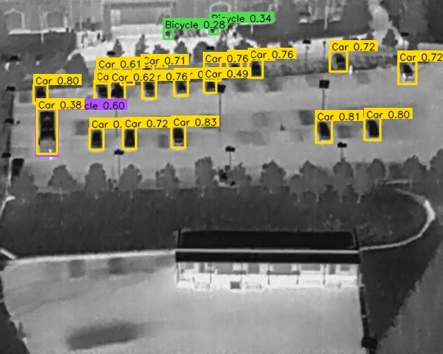
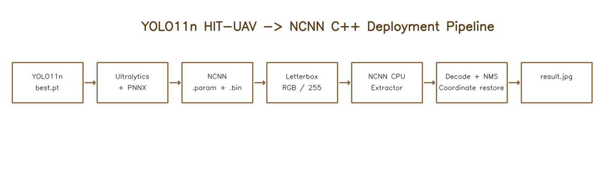
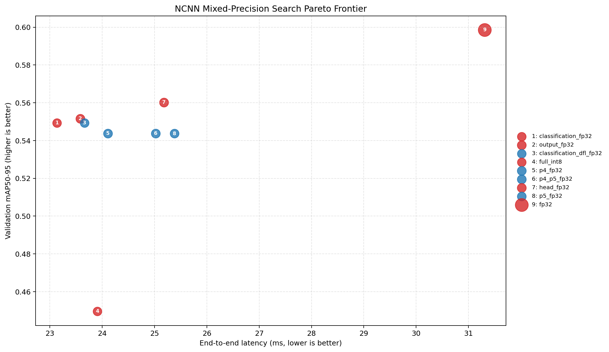

# YOLO11n HIT-UAV NCNN C++ 端侧部署项目

本项目将自行训练的 YOLO11n 红外无人机目标检测模型，从依赖 Python 和 PyTorch 的训练环境，转换为可以独立运行的 NCNN C++ 推理程序。

当前已经完成 FP32 CPU 部署闭环，并进一步实现了 INT8 PTQ、敏感层回退和自动混合精度搜索。仓库保留可复现实验代码、最终模型、原始 CSV 和面试讲解材料，不只展示一张推理结果图。



## 核心成果

| 项目 | FP32 基线 | 自动选择的混合精度模型 |
|---|---:|---:|
| 权重大小 | 9.95 MiB | 3.02 MiB（减少 69.7%） |
| 完整验证集 mAP50-95 | 0.5986 | 0.5602（下降 0.0384） |
| 端到端平均延迟 | 31.31 ms | 25.18 ms |
| FPS | 31.94 | 39.71 |

自动搜索在 `mAP50-95` 下降不超过 `0.04`、模型不超过 `3.5 MiB` 的约束下选择 `head_fp32`：Backbone/Neck 使用 INT8，Detection Head 保留 FP32。上述延迟来自同一次 20 次预热、100 次正式运行的 WSL CPU 实验，不代表 Android 真机性能。

## 一、完整流程

```text
YOLO11n best.pt
        │
        ▼
Ultralytics + PNNX 导出
        │
        ▼
model.ncnn.param + model.ncnn.bin
        │
        ▼
读取图片 → Letterbox → BGR 转 RGB → 除以 255
        │
        ▼
NCNN CPU Extractor 推理
        │
        ▼
解析 9×8400 输出 → 置信度过滤 → 分类 NMS
        │
        ▼
移除 Padding → 坐标还原 → 画框 → 保存结果
```



## 二、项目目录说明

```text
yolo11n-ncnn-deploy/
├── CMakeLists.txt                 # CMake 构建配置
├── README.md                      # 当前中文说明文档
├── include/
│   └── yolo_ncnn.h                # 数据结构、函数和检测器类声明
├── src/
│   ├── main.cpp                   # 命令行、整体流程、计时与 CSV 输出
│   ├── preprocess.cpp             # Letterbox、RGB 转换和归一化
│   ├── yolo_ncnn.cpp              # 模型加载与 NCNN Extractor 推理
│   └── postprocess.cpp            # 输出解析、NMS、坐标还原和画框
├── models/
│   ├── classes.txt                # 五个类别名称，顺序不能修改
│   ├── yolo11n_hit_uav_ncnn/
│   │   ├── model.ncnn.param       # 网络结构和 Blob 连接
│   │   └── model.ncnn.bin         # 二进制模型权重
│   └── yolo11n_hit_uav_ncnn_auto_mixed/
│       ├── model.ncnn.param       # 自动搜索导出的最优结构
│       ├── model.ncnn.bin         # 自动搜索导出的最优权重
│       └── policy.json            # 约束、FP32层和实测指标
├── assets/
│   ├── test.jpg                   # 单图演示输入
│   └── validation_images/         # 批量验证图片
├── outputs/                       # 推理画框结果
├── results/
│   ├── benchmark_ncnn_cpu.csv     # 100 次 CPU 性能原始数据
│   ├── backend_comparison.csv     # PyTorch/NCNN 逐图对比数据
│   ├── mixed_precision_search.csv # 自动搜索全部候选结果
│   ├── best_quantization_policy.json # 自动选择的最优策略
│   └── pareto_frontier.png        # 精度、延迟和大小Pareto图
├── scripts/
│   ├── build.sh                   # 编译 C++ 项目
│   ├── run_demo.sh                # 单图推理
│   ├── validate_batch.sh          # 批量运行验证图片
│   ├── benchmark.py               # 20 次预热、100 次正式测试
│   ├── compare_backends.py        # 对比两个后端的框和置信度
│   ├── prepare_validation_shapes.py # 生成竖图和正方形样例
│   ├── draw_architecture.py       # 生成项目架构图
│   ├── prepare_int8_calibration.py # 生成Letterbox校准集
│   ├── quantize_int8.sh           # 生成全INT8模型
│   ├── create_mixed_precision_tables.py # 生成敏感层回退表
│   ├── quantize_mixed_precision.sh # 生成混合精度模型
│   ├── evaluate_quantization.py   # 完整验证集精度评估
│   ├── summarize_quantization.py  # 汇总大小、精度与性能
│   ├── run_int8_demo.sh           # 运行人工推荐混合精度模型
│   ├── search_mixed_precision.py  # 自动解析、搜索、评估和选择
│   └── run_auto_mixed_demo.sh     # 运行自动搜索最优模型
└── docs/
    ├── assets/demo_auto_mixed.jpg # 自动混合精度推理效果
    └── project_architecture.png   # 项目流程图
```

## 三、编译方法

前置依赖：CMake、支持 C++17 的编译器、OpenCV，以及已经编译安装的 NCNN。

本机默认在以下位置寻找 NCNN：

```text
~/local/ncnn/lib/cmake/ncnn
```

进入项目并编译：

```bash
cd ~/projects/yolo11n-ncnn-deploy
./scripts/build.sh
```

编译成功后生成：

```text
build/yolo_ncnn
```

如果 NCNN 安装在其他位置，可以临时覆盖路径：

```bash
NCNN_DIR=/你的路径/lib/cmake/ncnn ./scripts/build.sh
```

## 四、运行单张图片

最简单的运行方式：

```bash
./scripts/run_demo.sh
```

脚本实际执行的完整命令：

```bash
./build/yolo_ncnn \
  --param models/yolo11n_hit_uav_ncnn/model.ncnn.param \
  --bin models/yolo11n_hit_uav_ncnn/model.ncnn.bin \
  --classes models/classes.txt \
  --image assets/test.jpg \
  --output outputs/result.jpg \
  --imgsz 640 \
  --conf 0.25 \
  --iou 0.45 \
  --threads 4
```

参数含义：

| 参数 | 含义 |
|---|---|
| `--param` | NCNN 网络结构文件 |
| `--bin` | NCNN 模型权重文件 |
| `--classes` | 类别名称文件 |
| `--image` | 输入图片 |
| `--output` | 画框结果保存路径 |
| `--imgsz` | 模型输入边长 |
| `--conf` | 置信度过滤阈值 |
| `--iou` | NMS 的 IoU 阈值 |
| `--threads` | NCNN CPU 线程数 |

## 五、模型输入和输出

### 输入

- Blob 名称：`in0`
- 形状：`1×3×640×640`
- 通道顺序：RGB
- 数据类型：FP32
- 像素范围：`[0,1]`

OpenCV 读取的是 BGR 图片，因此前处理必须执行 BGR 转 RGB。原始像素值为 0 到 255，因此还需要乘以 `1/255`。

### 输出

- Blob 名称：`out0`
- 布局：`9×8400`
- 9 个特征：`cx、cy、w、h` 和 5 个类别分数
- 8400 个候选点：`80×80 + 40×40 + 20×20`

导出图已经包含类别分数的 Sigmoid，但不包含 NMS，因此 C++ 程序负责置信度过滤和分类 NMS。

## 六、为什么需要 Letterbox

直接把 640×512 图片拉伸成 640×640 会改变目标宽高比。Letterbox 先按照相同比例缩放宽和高，再用像素值 114 填充空白区域。

程序记录以下信息用于坐标还原：

- `scale`：原图缩放倍数
- `pad_left`：左侧填充量
- `pad_top`：上侧填充量
- 原图宽高

坐标还原公式为：

```text
原图 x = (模型输入 x - pad_left) / scale
原图 y = (模型输入 y - pad_top) / scale
```

还原后还要把坐标限制在原图边界内。

## 七、批量正确性验证

运行批量测试：

```bash
./scripts/validate_batch.sh
```

程序会生成：

```text
outputs/result_001.jpg
...
outputs/result_012.jpg
```

其中包含十张原始验证图、一张竖图和一张正方形图。空目标场景正确输出零个检测。竖图和正方形图只用于验证 Letterbox 与坐标还原，不用于计算数据集精度。

运行 PyTorch 与 NCNN 数值对比：

```bash
python3 scripts/compare_backends.py
```

十张原始验证图的结果：

- PyTorch：158 个检测
- NCNN：162 个检测
- PyTorch 的 158 个框全部找到同类别、IoU 不低于 0.5 的 NCNN 匹配
- 加权平均匹配 IoU：0.9423
- 平均置信度绝对差：0.0170

这组数据说明转换前后输出高度一致，但它衡量的是后端一致性，不是基于真实标签计算的 mAP。

## 八、CPU Benchmark

运行性能测试：

```bash
python3 scripts/benchmark.py
```

测试设置：

- 输入：640×512 测试图
- 模型输入：640×640
- CPU 线程：4
- Warmup：20 次
- 正式运行：100 次

本机 WSL 环境实测：

| 阶段 | 平均耗时 |
|---|---:|
| 前处理 | 1.63 ms |
| NCNN 推理 | 26.38 ms |
| 后处理 | 0.04 ms |
| 端到端 | 28.04 ms |

- P50：26.31 ms
- P95：37.28 ms
- FPS：35.66

这些数据是当前 WSL 主机 CPU 的结果，不能表述为 Android 真机性能。

## 九、INT8 PTQ 与混合精度量化

本项目已经完成 NCNN INT8 PTQ，并针对红外小目标精度下降问题增加了混合精度实验。

量化流程：

```text
2029张训练图片
→ 复现部署 Letterbox
→ KL 激活校准
→ 全 INT8
→ 完整验证集评估
→ 敏感检测头回退 FP32
→ 重新评估精度、大小和延迟
```

四种方案的实测结果：

| 方案 | 权重大小 | mAP50 | mAP50-95 | 端到端延迟 | FPS |
|---|---:|---:|---:|---:|---:|
| FP32 | 9.95 MiB | 0.8843 | 0.5986 | 28.00 ms | 35.71 |
| 全 INT8 | 2.61 MiB | 0.8131 | 0.4496 | 24.74 ms | 40.42 |
| 输出层 FP32 | 2.94 MiB | 0.8446 | 0.5516 | 23.20 ms | 43.11 |
| 检测头 FP32 | 3.02 MiB | 0.8512 | 0.5602 | 23.02 ms | 43.45 |

当前推荐“检测头 FP32”混合精度方案。它让骨干和颈部使用 INT8，同时保留检测头 FP32，权重相对 FP32 缩小约 69.7%，端到端延迟降低约 17.8%。

运行推荐模型：

```bash
./scripts/run_int8_demo.sh
```

量化代码位于 `scripts/prepare_int8_calibration.py`、`scripts/quantize_int8.sh` 和 `scripts/create_mixed_precision_tables.py`，完整指标保存在 `results/quantization_summary.csv`。

## 十、混合精度自动搜索

项目新增了可重复运行的NCNN混合精度自动搜索工具：

```text
scripts/search_mixed_precision.py
```

它会自动：

1. 解析NCNN `.param`计算图。
2. 从`out0`反向识别检测头边界。
3. 识别分类、回归、DFL及P3/P4/P5尺度分组。
4. 生成15个去重候选策略。
5. 使用60张背景、小目标和密集场景代理集筛选。
6. 对入围策略运行完整290张验证集。
7. 执行20次预热和100次C++ Benchmark。
8. 计算精度、延迟和模型大小三目标Pareto前沿。
9. 根据精度下降和模型大小约束自动导出最优模型。

运行：

```bash
python3 \
  scripts/search_mixed_precision.py \
  --param models/yolo11n_hit_uav_ncnn/model.ncnn.param \
  --bin models/yolo11n_hit_uav_ncnn/model.ncnn.bin \
  --table results/int8_calibration.table \
  --max-map-drop 0.04 \
  --max-model-mib 3.5
```

自动识别结果：25个检测头卷积、7个最终预测卷积和6400/1600/400三个尺度。在当前约束下，工具自动选择`head_fp32`，即Backbone/Neck使用INT8、Detection Head使用FP32。

运行自动导出的模型：

```bash
./scripts/run_auto_mixed_demo.sh
```

关键产物：

```text
results/mixed_precision_search.csv
results/pareto_frontier.png
results/best_quantization_policy.json
models/yolo11n_hit_uav_ncnn_auto_mixed/
```



自动搜索的实现细节以 `scripts/search_mixed_precision.py` 为准，全部候选实验记录位于 `results/mixed_precision_search.csv`。

## 十一、建议阅读代码的顺序

第一次阅读不要直接从 `main.cpp` 的第一行硬看到底，建议按以下顺序：

1. 阅读 `include/yolo_ncnn.h`，先认识项目中的数据结构和接口。
2. 阅读 `src/preprocess.cpp`，理解一张图片如何变成模型输入张量。
3. 阅读 `src/yolo_ncnn.cpp`，理解模型如何加载以及 Blob 如何输入输出。
4. 阅读 `src/postprocess.cpp`，重点理解输出布局、坐标还原和 NMS。
5. 最后阅读 `src/main.cpp`，把参数解析、推理、计时和保存过程串成完整流程。
6. 运行 `scripts/run_demo.sh`，对照终端日志逐步跟踪程序。

每条有效代码上方都增加了中文说明。部分很短的括号、参数或容器操作，其注释用于说明语法角色；算法原理应结合所在函数上方的整体说明理解。

## 十二、当前项目边界

已经完成：

- YOLO11n 转 NCNN
- FP32 CPU 推理
- 独立 C++17 程序
- Letterbox、输出解析、分类 NMS 和坐标还原
- 十二张图片验证
- PyTorch/NCNN 一致性对比
- CPU Benchmark
- INT8 PTQ
- 两种混合精度敏感层回退实验
- 完整 290 张验证集量化精度评估
- NCNN图解析与检测头自动识别
- 15组混合精度候选自动生成
- 代理集筛选、Pareto分析与约束选择

尚未完成：

- NCNN Vulkan
- Android NDK/JNI
- PyTorch、ONNXRuntime、TensorRT、NCNN 四后端统一 Benchmark
- 上游 Issue 或 PR

尚未完成的内容不能提前作为已经实现的成果写入简历。

## 十三、数据来源与引用

训练和演示图片来自 [HIT-UAV](https://github.com/suojiashun/HIT-UAV-Infrared-Thermal-Dataset)，原数据集采用 CC BY 4.0 许可。仓库中的样例图是该数据集的子集，自动混合精度权重由本人训练的 YOLO11n 模型转换得到。

如果使用本仓库中的 HIT-UAV 样例或复现实验，请同时引用原数据集论文：

```bibtex
@article{suo2023hit,
  title={HIT-UAV: A high-altitude infrared thermal dataset for Unmanned Aerial Vehicle-based object detection},
  author={Suo, Jiashun and Wang, Tianyi and Zhang, Xingzhou and Chen, Haiyang and Zhou, Wei and Shi, Weisong},
  journal={Scientific Data},
  volume={10},
  pages={227},
  year={2023}
}
```

本仓库暂未单独授予源码再分发许可；NCNN、Ultralytics 及其他依赖分别遵循其上游许可证。
